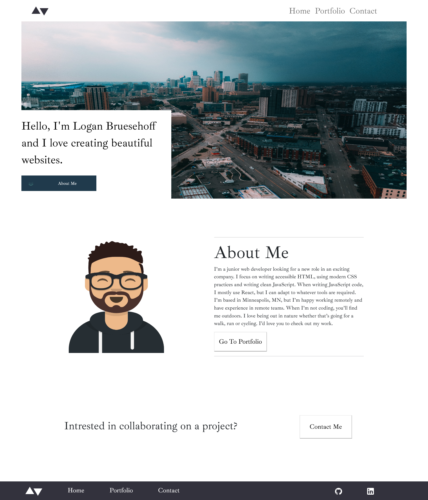

## Table of contents

- [Overview](#overview)
  - [The challenge](#the-challenge)
  - [Screenshot](#screenshot)
  - [Links](#links)
- [My process](#my-process)
  - [Built with](#built-with)
  - [What I learned](#what-i-learned)
  - [Continued development](#continued-development)
  - [Useful resources](#useful-resources)
- [Author](#author)
- [Acknowledgments](#acknowledgments)

## Overview

### The challenge

Users should be able to:

- View the optimal layout for each page depending on their device's screen size
- See hover states for all interactive elements throughout the site
- Click the "About Me" call-to-action on the homepage and have the screen scroll down to the next section
- Receive an error message when the contact form is submitted if:
  - The `Name`, `Email Address` or `Message` fields are empty should show "This field is required"
  - The `Email Address` is not formatted correctly should show "Please use a valid email address"

### Screenshot




### Links

- Live Site URL: [https://loganbruesehoff.com/]

## My process

### Built with

- Semantic HTML5 markup
- CSS custom properties
- Flexbox
- CSS Grid
- Mobile-first workflow
- [React](https://reactjs.org/) - JS library
- [Styled Components](https://styled-components.com/) - For styles

**Note: These are just examples. Delete this note and replace the list above with your own choices**

### What I learned

During this project I learned how to build a web application using React. I learned about React Router and components.
I learned CSS Flex-box making this website responsive on all devices.
I used Email JS to send emails to my primary email.

```
```js
export default function ContactForm() {
      const form = useRef();
      const sendEmail = (e) => {
      e.preventDefault();

      emailjs.sendForm('gmail', 'template_u7hqsni', form.current, 'user_ID')
        .then((result) => {
            console.log(result.text);
        }, (error) => {
            console.log(error.text);
        });
        e.target.reset()
    };
```

### Continued development

This is my personal website and I will be putting my future projects on here for employers to see.

